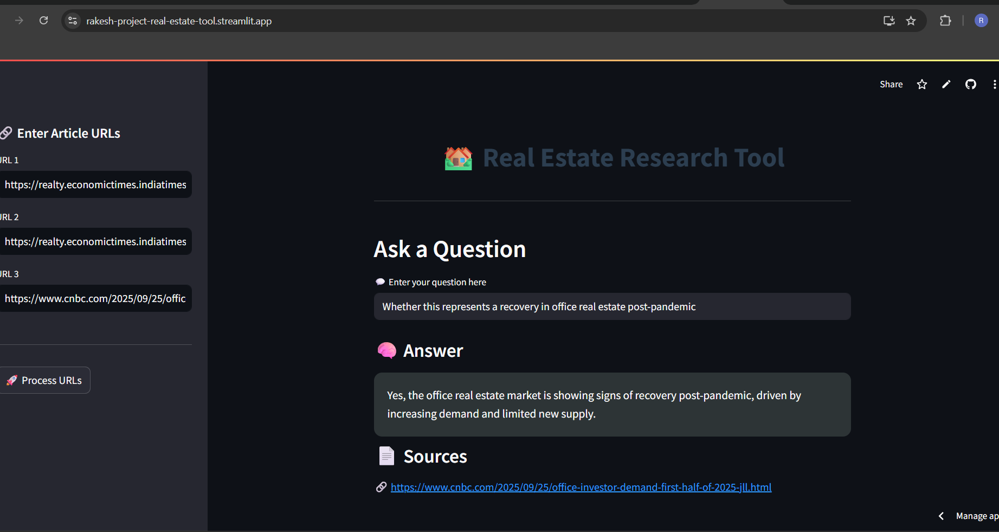

# Real Estate Research Tool

A user-friendly web application developed using Streamlit that enables fast and insightful real estate research. Users can enter news article URLs and ask questions to receive answers grounded in the actual content using RAG (Retrieval-Augmented Generation). Though focused on real estate, this tool can be extended to any domain with textual sources.

## 🌐 Live Demo
Try it out here: **[Click Here](https://rakesh-project-real-estate-tool.streamlit.app/)**  

---

## 🛠 Features

- Visually enhanced and interactive UI built with Streamlit.
- Input multiple real estate article URLs and extract meaningful insights.
- Uses BeautifulSoup to scrape news content from provided URLs.
- Text is chunked and embedded using HuggingFace’s MiniLM model.
- Stores embeddings in ChromaDB for efficient semantic search.
- Generates answers using Llama3 models via Groq API.
- Displays answer and source links for transparency.
- Easily extendable to other domains (e.g., finance, politics).

---

## 📁 Project Files

 ```
real-estate-assistant/
│
├── resources/
│   ├── vectorstore/             # Local DB directory (Chroma) 
│
├── main.py                      # Streamlit app logicc
├── rag.py                       # RAG logic: scraping, embedding, answering
├── requirements.txt             # List of dependencies
└── README.md                    # Project documentation
```

---

## 🚀 How to Run Locally

### ⚠️ Note for Windows Users
This project uses **ChromaDB**, which requires **SQLite ≥ 3.35.0**.  

- Most Linux environments (like **Streamlit Cloud**) are patched using `pysqlite3-binary`.  
- ❌ Do **NOT** install `pysqlite3-binary` on Windows — it's only meant for Linux deployments.  

👉 If you're on **Windows**:
- If the app works, your SQLite is already up-to-date.  
- If you encounter a `sqlite3` version error:  
  - Install **SQLite ≥ 3.35.0** manually.  
  - Ensure it's added to your **system PATH**.  

---

### Prerequisites
- Python **3.8+**

### Setup Instructions
```bash
# Clone the repository
git clone https://github.com/vaibhavgarg2004/Real-Estate-Research-Tool.git
cd Real-Estate-Research-Tool

# Install dependencies
pip install -r requirements.txt

# Add GROQ credentials in a .env file
GROQ_API_KEY=GROQ_API_KEY_HERE

# Run the Streamlit app
streamlit run main.py
```
---

## 🧠 How It Works

### 🔗 URL Input & Scraping
- Users enter up to **3 article URLs** in the sidebar.  
- HTML content is scraped using **requests + BeautifulSoup**.  

### ⚙️ Processing & Storage
- Articles are split into chunks using **LangChain’s RecursiveCharacterTextSplitter**.  
- Chunks are **embedded** using `sentence-transformers/all-MiniLM-L6-v2`.  
- Stored in **ChromaDB** for **vector-based semantic retrieval**.  

---
### 🖼️ Application Snapshot

